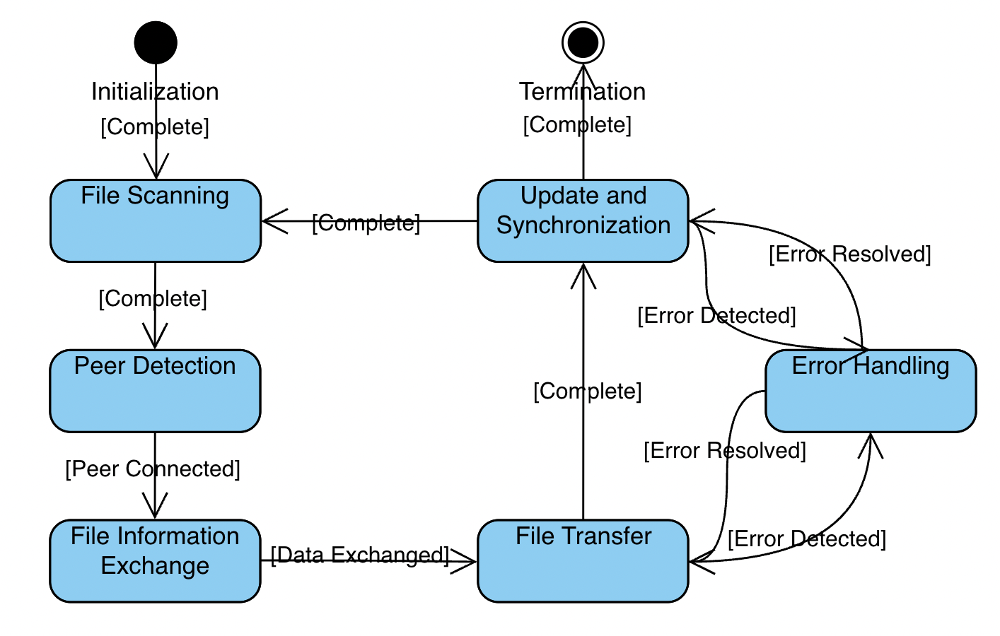

# Large Efficient Flexible and Trusty (LEFT) File Sharing Program
This program is a TCP file sharing tool built using Python Socket and multithreading. It allows for efficient, flexible, and reliable file sharing between two virtual machines. The program includes features such as automatic file synchronization and breakpoint resume, implemented through a self-designed application-layer protocol with specialized message types and error handling mechanisms.

## Guideline

Install the Python package paramiko:

```shell
$ pip install paramiko
```


Modify the IP addresses in the `main.py` to yours: 

```python
PC_A_IP = ('192.168.49.128', 8001)
PC_B_IP = ('192.168.49.129', 8001)
```

Run the test script `main.py`:

```shell
$ python main.py
```

## File Sharing Process



1. **Initialization State**
   - Description: This is where the program starts. It involves initializing sockets for file information (`info_socket`) and file transfer (`file_socket`). The server listens on specified ports and sets up for incoming connections.
   - Key Actions: Initialize sockets, bind to ports, listen for connections.

2. **File Scanning State**
   - Description: The program scans the shared directory to identify new or updated files. It compares the current state of files in the directory with the recorded state in `file_info`.
   - Key Actions: Traverse shared folder, update `file_info`, identify new or updated files.

3. **Peer Detection State**
   - Description: The program attempts to detect and connect to peers. It checks for the presence of peers and establishes a connection for file information and file block transfer.
   - Key Actions: Connect to peer's info and file transfer ports, update `peer_status`.

4. **File Information Exchange State**
   - Description: Once connected to a peer, the program exchanges information about new or updated files. This includes sending and receiving JSON-encoded data about file changes.
   - Key Actions: Send/receive file information (new or updated files), handle JSON data.

5. **File Transfer State**
   - Description: In this state, the program handles the actual transfer of file blocks. It either downloads new files or updates existing files based on the received information.
   - Key Actions: Request and receive file blocks, write/update files on disk.

6. **Update and Synchronization State**
   - Description: The program updates its local file information based on the completed transfers. It synchronizes the state of its files with the peer's files.
   - Key Actions: Update `file_info` based on new downloads or updates, synchronize with peer.

7. **Error Handling and Resilience State**
   - Description: The program monitors for any errors or interruptions in the file transfer process and attempts to resume incomplete transfers (breakpoint resume).
   - Key Actions: Detect and handle errors, resume interrupted file transfers.

8. **Termination State**
   - Description: This state represents the end of the file sharing process. The program closes connections and releases resources.
   - Key Actions: Close sockets, clean up resources, end the program.

